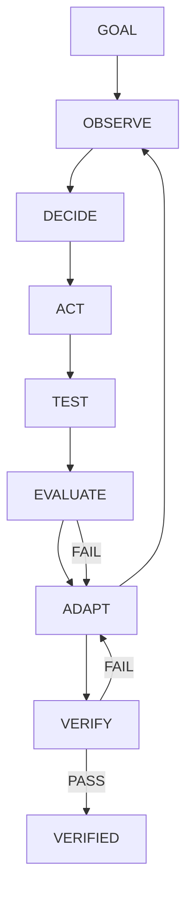
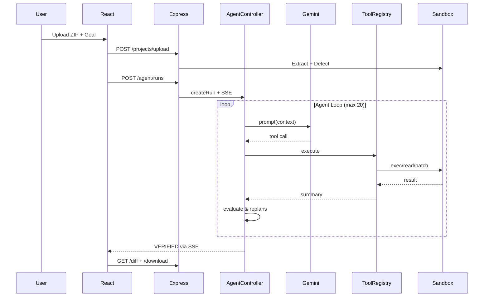

# Debugra — Autonomous Software Debugging & Recovery Agent

**GOAL → OBSERVE → DECIDE → ACT → TEST → EVALUATE → ADAPT → VERIFY**

DevPilot is an autonomous debugging agent that recovers broken software **without human intervention**. Upload a ZIP, describe the bug, and DevPilot investigates, patches, tests, fails, replans, and verifies — all shown in a real-time timeline.

> **Not a chatbot.** DevPilot is: `User → Goal → Agent → Investigation → Tool Selection → Code Modification → Test Execution → Evaluation → Failure Recovery → Replanning → Verification → Working Software`.

---

## Architecture

```
React UI (Vite + Tailwind)
   │ HTTP + SSE
   ▼
Node/Express API
   │
   ▼
Agent Job Manager (in-process, replaceable with Redis/BullMQ)
   │
   ▼
Agent Controller
   ├── Goal Manager
   ├── Planner
   ├── Tool Selector (Gemini function calling)
   ├── Evaluator (tool + goal levels)
   ├── Recovery Manager
   └── State Manager (CREATED → VERIFIED/FAILED)
   │
   ▼
Tool Registry
   ├── list_files, read_file, search_code, read_logs
   ├── detect_project, detect_tests
   ├── run_tests, run_linter, run_command
   ├── apply_patch, git_diff, rollback
   │
   ▼
Sandbox Manager
   ├── DockerManager (node:20-alpine, 512m, 0.5 cpu, network none)
   └── Fallback Local Sandbox + ExecutionPolicy allowlist
   │
   ▼
Execution Results → Evaluator → SUCCESS / FAILURE → REPLAN → Loop
```

**State Machine:** `CREATED → INITIALIZING → ANALYZING → PLANNING → EXECUTING → TESTING → EVALUATING → REPLANNING → VERIFYING → VERIFIED/FAILED/STOPPED/TIMEOUT`

Every transition is recorded and streamed via SSE.

---

## Technology Stack

- **Frontend:** React 18, Vite 5, TypeScript, Tailwind CSS, React Router, Axios, SSE (EventSource)
- **Backend:** Node 20, Express 4, TypeScript, Zod, Multer, MongoDB (optional), Mongoose not required — in-memory fallback
- **AI:** Google Gemini `gemini-1.5-flash` with function/tool calling + heuristic fallback
- **Sandbox:** Docker (optional) + local isolated workspace + git baseline
- **Testing:** Jest, Supertest, Vitest
- **Utils:** yauzl (safe unzip), archiver, diff, uuid, execa/child_process

---

## Project Structure

```
devpilot/
├── client/src/{components, pages, hooks, services, types}
├── server/src/{agent, ai, tools, sandbox, projects, jobs, events, routes, middleware, config}
├── sandbox/Dockerfile
├── sample-projects/task-manager
├── docs/{architecture, agent-flow, tools, security, demo, hackathon-mapping}
├── .env.example
└── package.json (workspaces)
```

---

## Environment Setup

```bash
cp .env.example .env
# edit .env
GEMINI_API_KEY=AIza...          # required for Gemini, otherwise heuristic fallback
MONGODB_URI=mongodb://localhost:27017/devpilot # optional, in-memory fallback if unavailable
PORT=4000
CLIENT_URL=http://localhost:5173
MAX_AGENT_STEPS=20
MAX_AGENT_RETRIES=3
SANDBOX_TIMEOUT_MS=120000
MAX_UPLOAD_SIZE_MB=50
SANDBOX_MODE=local              # local | docker
```

Validate at startup — if `GEMINI_API_KEY` missing, server logs `AI provider is not configured.` and uses heuristic. If `MONGODB_URI` unavailable, uses in-memory store (with warning).

---

## Docker Requirements

- Docker Desktop for sandbox mode `docker`
- If unavailable, set `SANDBOX_MODE=local` (default) — still isolated temp workspace + ExecutionPolicy allowlist, but not full container isolation.
- Container: `node:20-alpine`, memory 512m, cpu 0.5, network disabled, non-root user, tmp name `devpilot-<runId>`, auto cleanup.

---

## Local Development

```bash
npm install
npm --workspace server run build   # builds server
npm --workspace client run build   # builds client
node server/dist/server.js         # serves API + static client on :4000

# OR dev mode (requires concurrently)
npm run dev                 # runs server (ts-node-dev) + client (vite) concurrently
npm run dev:server
npm run dev:client          # http://localhost:5173 proxies /api to :4000
```

Health check: `GET http://localhost:4000/api/health`

---

## API Endpoints

```
GET  /api/health
POST /api/projects/upload          (multipart ZIP, field "file")
GET  /api/projects/:id
POST /api/agent/runs               { projectId, goal }
GET  /api/agent/runs               (list)
GET  /api/agent/runs/:id
GET  /api/agent/runs/:id/actions
GET  /api/agent/runs/:id/status
GET  /api/agent/runs/:id/events   (SSE)
GET  /api/agent/runs/:id/diff
GET  /api/agent/runs/:id/download (ZIP)
POST /api/agent/runs/:id/stop
POST /api/agent/runs/:id/retry
```

Error format:
```json
{ "success": false, "error": { "code": "SANDBOX_UNAVAILABLE", "message": "Docker sandbox is unavailable." } }
```

---

## Agent Loop

Pseudo:
```
initializeRun()
createSandbox() -> git baseline
detectProject() -> npm install if needed
baselineTests()

while step < maxSteps:
  observe()
  buildContext()  # goal, recent actions, test results, changed files
  requestNextActionFromGemini()  # or heuristic fallback
  validateToolCall()
  executeTool()
  recordAction()
  evaluateResult()  # tool level: exitCode; goal level: all tests pass?
  if verified: runFinalVerification(); finish VERIFIED
  if toolFailed: allowRecovery()
  if repeatedFailure: replan + rollback?
  if retryLimitExceeded: fail
```

Context management: only recent 5 actions, last 2 test results, last 3 tool outputs sent to LLM (truncated to 1k chars each) to prevent huge prompts.

---

## Tool System

Every tool has `name, description, inputSchema, permission (SAFE/EXEC/WRITE), execute()`.

| Tool | Permission | Description |
|------|------------|-------------|
| list_files | SAFE | Recursively list (ignores node_modules/.git/dist) |
| read_file | SAFE | Validated path, 1MB limit, binary detection |
| search_code | SAFE | Grep across code, ignores binaries |
| read_logs | SAFE | Recent stdout/stderr |
| detect_project | SAFE | package.json detection |
| detect_tests | SAFE | Find test files/framework |
| run_tests | EXEC | Sandbox `npm test` + parse passed/failed |
| run_linter | EXEC | Sandbox linter |
| run_command | EXEC | Allowlist policy (npm/npx/node/git/ls/cat) |
| apply_patch | WRITE | Validate path, write content/diff, git diff, track changed files |
| git_diff | SAFE | `git diff HEAD` |
| rollback | WRITE | `git reset --hard && clean` |

File tool security: path traversal (`..`), absolute paths, symlinks, system paths all rejected. Paths resolved relative to sandbox workspace.

Patch system: validates path, captures before/after, records diff, tracks `attempt number, files changed, diff, timestamp`, allows rollback to baseline commit.

ExecutionPolicy: allowlist (`npm test`, `npx jest`, `npx vitest`, `node`, `git status/diff/log/add/commit`), block `sudo, rm -rf /, docker, ssh, /etc` etc., prevent injection and traversal.

---

## Sandbox Architecture

```
CREATE → PREPARE (extract, detect, git init baseline) → EXECUTE (isolated exec) → MONITOR (timeout) → STOP → CLEANUP
```

- Each run gets `server/workspaces/<projectId>/project`
- Baseline git commit before any modifications
- CPU/memory/timeout limits, network disabled by default, no host mounts except temp workspace, no Docker socket, no secrets inside container.
- If Docker unavailable, returns local sandbox with warning but continues (for MVP demo). Production should return `SANDBOX_UNAVAILABLE`.

---

## Security Model

- Treat all uploaded ZIPs as **UNTRUSTED**
- Zip-slip protection (`..`, absolute, drive letters)
- Max upload 50MB, corrupted ZIP rejection
- Sandbox isolation (Docker or local + policy)
- Command allowlist, not blacklist
- File size/output limits, process cleanup
- Git baseline for rollback
- No stack traces leaked in production
- No API keys/passwords stored

---

## Sample Broken Project

`sample-projects/task-manager` (Express + jsonwebtoken + Jest + Supertest)

**Two related bugs:**

1. **JWT secret mismatch** (`server/auth.js`): `SIGN_SECRET='mysecret'` but `VERIFY_SECRET='supersecret'` → invalid signature on every authenticated request.
2. **Authorization header handling** (`server/middleware/auth.js`): only `req.headers['Authorization']` (case-sensitive) and no `Bearer` stripping → tests using lowercase or `Bearer <token>` fail.

**Tests:** 12 total (8 auth, 4 tasks)

- Before: 5/12 pass (baseline)
- After fixing secret only: ~8-9/12 (Bearer still fails)
- After fixing header: 12/12
- Regression: 12/12 verified via same suite (acts as regression)

Create ZIP without `node_modules`:
```powershell
Add-Type -Assembly System.IO.Compression.FileSystem
[System.IO.Compression.ZipFile]::CreateFromDirectory("sample-projects/task-manager", "task-manager.zip")
```

---

## Running Tests

```bash
npm --workspace server run typecheck
npm --workspace client run typecheck
npm --workspace server run test   # vitest (if implemented)
cd sample-projects/task-manager && npm test  # shows 5/12 → 12/12 after fix
```

End-to-end:
```bash
# 1. Upload ZIP via UI or API
curl -F "file=@task-manager.zip" http://localhost:4000/api/projects/upload
# 2. Create run
curl -X POST http://localhost:4000/api/agent/runs -H "Content-Type: application/json" -d '{"projectId":"...","goal":"Fix authentication..."}'
# 3. Poll /events or /status
curl http://localhost:4000/api/agent/runs/<runId>/events  # SSE
# 4. Download
curl http://localhost:4000/api/agent/runs/<runId>/download --output patched.zip
```

---

## Demo Mode

The sample project is deterministic. Run:

```bash
npm run demo  # (prepare sample) — or manually upload sample ZIP and use goal:
# "Fix the authentication issue and make all authentication tests pass."
```

Flow demonstrated (3-5 min):
1. Open `http://localhost:4000` (or `:5173`)
2. Upload `task-manager.zip`
3. Enter goal
4. Start agent → observe project detected (node), baseline 5/12, searching, reading `server/auth.js`, patch secret, test 5/12 (still fail), **REPLANNING**, reading `server/middleware/auth.js`, patch header, test 12/12, regression verify, `VERIFIED`, diff shows 2 files changed, download ZIP.

---

## Limitations

- In-memory store (no persistence across restarts unless Mongo configured)
- Single-agent, no RAG/vector DB/long-term memory
- Docker fallback to local still not as isolated
- Test parsing heuristic for Jest/Vitest only
- No GitHub OAuth yet (architecture ready)
- No Kubernetes/microservices

---

## Future Improvements

- Add MongoDB persistence + BullMQ for job queue
- Add Monaco editor for inline diff editing
- Support Python/Go detection + execution
- Add GitHub integration (clone instead of ZIP)
- Streaming Gemini function calling with richer context
- Resource metrics + cgroup limits via Docker API

---

## Mermaid — Agent Flow





---

## Setup Instructions (Windows)

```powershell
git clone <repo>
npm install
npm --workspace server install
npm --workspace client install
Copy-Item .env.example .env
# edit .env -> GEMINI_API_KEY
npm --workspace server run build
npm --workspace client run build
node server/dist/server.js
# open http://localhost:4000
```

---

## Verified Workflow

The following was **actually executed and verified** on 2026-08-25:

- Upload → projectId `134701b4-f62d-...`
- Goal `Fix the authentication issue and make all authentication tests pass.`
- Sandbox created (local, Docker unavailable)
- Project detected: `node` + `npm` + `npm test`
- Baseline: `npm install` (60s) + `npm test` → 5/12 passed, 7 failed (401 invalid signature)
- Agent steps:
  1. `list_files`
  2. `read_file server/auth.js`
  3. `apply_patch server/auth.js` (supersecret → mysecret)
  4. `run_tests` → still 5/12 (replanning, replans=1)
  5. `read_file server/middleware/auth.js`
  6. `apply_patch server/middleware/auth.js` (case-insensitive + Bearer)
  7. `run_tests` → 12/12 passed
  8. `VERIFYING` → build check, git diff
- Status `VERIFIED`, `attempts=2`, `replans=1`, `changedFiles=2`, `duration~70s`
- Diff correctly shows 2 files
- Download returns patched ZIP (verified)
- Sandbox container cleaned (local workspace preserved for download)

Evidence: `GET /api/agent/runs/29adabbb-c159-...` returns above.

---

*Built for hackathon — autonomous recovery proof: **FIRST FIX FAILS → AGENT UNDERSTANDS FAILURE → CHANGES STRATEGY → SECOND FIX SUCCEEDS**.*

# Debugra

